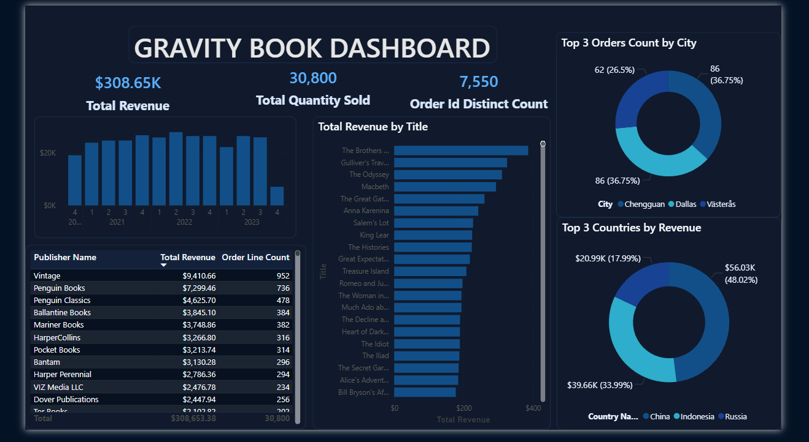
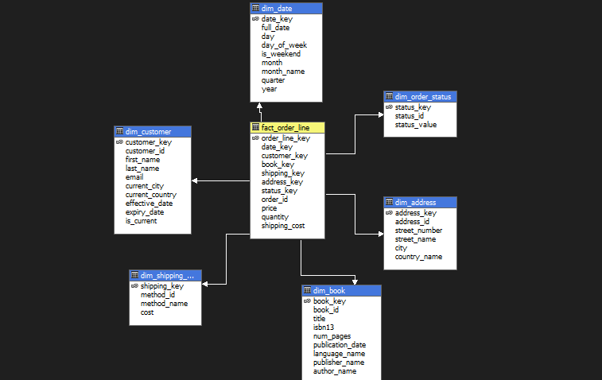
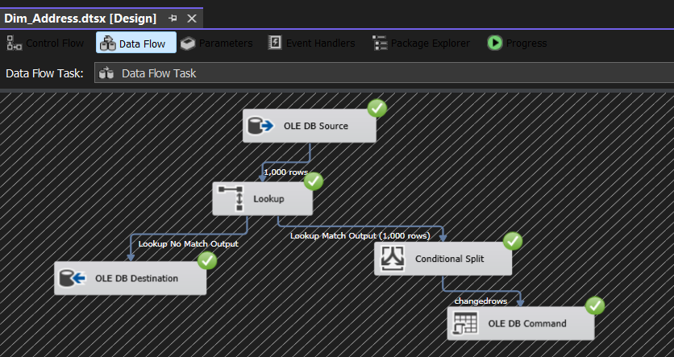
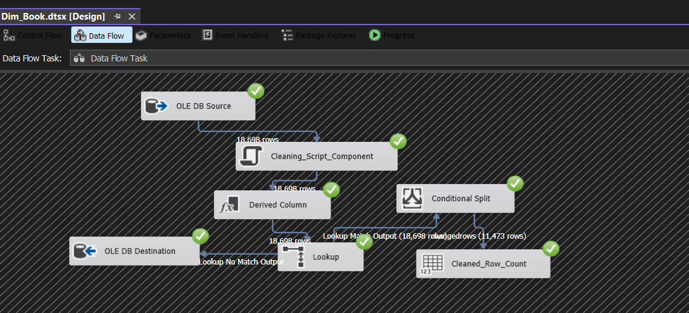
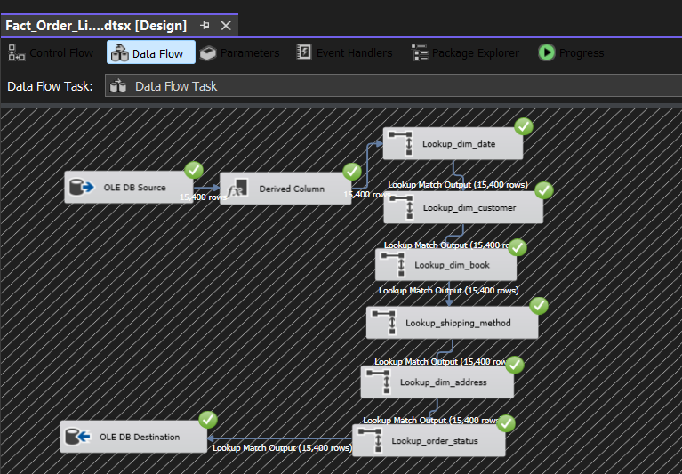

# Gravity Books Data Warehouse

A comprehensive data warehousing solution built with Microsoft SQL Server, SSIS, SSAS, and Power BI. This project implements a complete ETL pipeline and OLAP cube for business intelligence and analytics.

## Overview

The Gravity Books Data Warehouse is designed to consolidate and analyze book-related data from multiple sources. It provides a unified data model for reporting, analytics, and decision-making through a multi-dimensional OLAP cube and interactive Power BI dashboards.

## Architecture

### Components

1. **SSIS Project (SQL Server Integration Services)**
   - ETL pipeline for data extraction and transformation
   - Automated data loading into dimensional and fact tables
   - Connection management and data validation

2. **SSAS Project (SQL Server Analysis Services)**
   - Multi-dimensional OLAP cube for analytical queries
   - Dimensions: Address, Book, Customer, Date, Order Status, Shipping Method
   - Fact Table: Order Line
   - Optimized for ad-hoc analysis and reporting

3. **Power BI Dashboard**
   - Interactive visualizations and reports
   - Real-time connectivity to the data warehouse
   - Business metrics and KPI monitoring

## Project Structure

```
gravity-books-data-warehouse/
├── SSIS_Project/
│   ├── Dim_Address.dtsx
│   ├── Dim_Book.dtsx
│   ├── Dim_Customer.dtsx
│   ├── Dim_Order_Status.dtsx
│   ├── Dim_Shipping.dtsx
│   ├── Fact_Order_Line.dtsx
│   ├── load_shipping_method.dtsx
│   ├── Project.params
│   ├── SSIS_Project.database
│   ├── ssis_project.dtproj
│   ├── dwh_connection.conmgr
│   └── source_connection.conmgr
├── SSAS_Project/
│   ├── Dim Address.dim
│   ├── Dim Book.dim
│   ├── Dim Customer.dim
│   ├── Dim Date.dim
│   ├── Dim Order Status.dim
│   ├── Dim Shipping Method.dim
│   ├── Dw Gravity Books.cube
│   ├── Dw Gravity Books.ds
│   ├── Dw Gravity Books.dsv
│   ├── Dw Gravity Books.partitions
│   ├── SSAS_Project.database
│   └── ssas_project.dwproj
├── gravity_book_dashboard.pbix
└── Screenshots/

```

## Dimensions and Fact Tables

### Dimensions
- **Dim_Address**: Geographic information
- **Dim_Book**: Book catalog information
- **Dim_Customer**: Customer master data
- **Dim_Date**: Time dimension for temporal analysis
- **Dim_Order_Status**: Order status categories
- **Dim_Shipping_Method**: Shipping method details

### Fact Tables
- **Fact_Order_Line**: Order line transaction facts including quantities and amounts

## Power BI Dashboard



The Power BI dashboard provides an interactive interface for exploring key business metrics and trends in the Gravity Books data.

## Data Flow

1. **Source Data**: External data sources
2. **SSIS ETL**: Data extraction, transformation, and loading
3. **Data Warehouse**: Dimensional and fact tables in SQL Server
4. **SSAS Cube**: Multi-dimensional analysis structure
5. **Analytics**: Power BI dashboards and reports

## Key Features

- Automated data loading and refresh cycles
- Conformed dimensional model for consistency
- OLAP cube for fast analytical queries
- Interactive Power BI visualizations
- Connection management for multiple data sources
- Parameter-driven package configurations

## Technologies Used

- Microsoft SQL Server
- SQL Server Integration Services (SSIS)
- SQL Server Analysis Services (SSAS)
- Power BI Desktop
- Power BI Service

## Getting Started

1. **Prerequisites**
   - SQL Server 2017 or higher
   - SQL Server Management Studio
   - SSIS/SSAS Tools
   - Power BI Desktop

2. **Setup**
   - Configure data source connections in SSIS packages
   - Deploy SSIS project to SQL Server
   - Deploy SSAS project and process cube
   - Connect Power BI to the SSAS cube

3. **Data Load**
   - Execute SSIS packages to load dimension tables
   - Execute fact table loading packages
   - Process SSAS cube for analytics

## Screenshots

### SSAS Cube Design


### Dimension Examples



### Fact Table


## Maintenance

- Regular data refreshes through scheduled SSIS packages
- Cube processing for updated analytics
- Connection management for source systems
- Performance monitoring and optimization

## Contact

Created by: Abdelrahmann Ali

## License

This project is part of a Data Warehouse development initiative.
